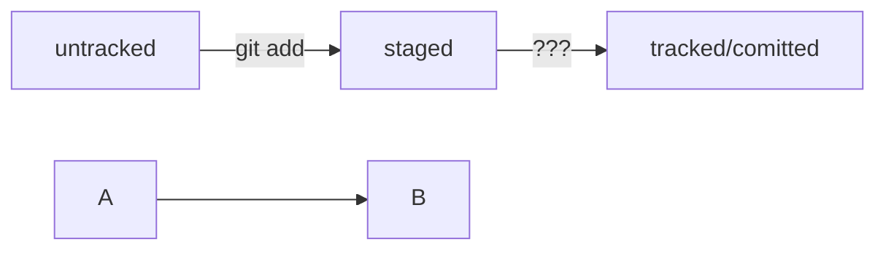

--------------
Хеш — идентификатор коммита
Хеширование (от англ. hash, «рубить», «крошить», «мешанина») — это способ преобразовать набор данных и получить 
их «отпечаток» (англ. fingerprint).
--------------
Лог.
Вот из каких элементов состоит описание:

1. Строка из цифр и латинских букв после слова **commit** — это уже знакомый вам хеш коммита.
2. **Author** — имя автора и его электронная почта.
3. **Date** — дата и время создания коммита.
4. Сообщение к коммиту.
---------------
HEAD
Файл HEAD (англ. «голова», «головной») — один из служебных файлов папки .git. Он указывает на коммит, 
который сделан последним (то есть на самый новый).
---------------
git status
### Статусы `untracked`/`tracked`, `staged` и `modified`

Одна из ключевых задач Git — отслеживать изменения файлов в репозитории. Для этого каждый файл помечается 
каким-либо статусом. Рассмотрим основные.

- **`untracked`** (англ. «неотслеживаемый»)
  Новые файлы в Git-репозитории помечаются как `untracked`, то есть неотслеживаемые. Git «видит», что такой 
  файл существует, но не следит за изменениями в нём. У `untracked`файла нет предыдущих версий, зафиксированных 
  в коммитах или через команду `git add`.
- **`staged`** (англ. «подготовленный»)
  После выполнения команды `git add` файл попадает в **staging area** (от англ. *stage* — «сцена», 
  «этап [процесса]» и *area* — «область»), то есть в список файлов, которые войдут в коммит. В этот момент 
  файл находится в состоянии `staged`.

💡 Staging area также называют **index** (англ. «каталог») или **cache** (англ. «кеш»), а состояние 
файла `staged` иногда называют `indexed` или `cached`. Все три варианта могут встречаться в документации 
и в качестве флагов команд Git. А также в интернете — например, в вопросах и 
ответах [на сайте Stack Overflow](https://stackoverflow.com/).

- **`tracked`** (англ. «отслеживаемый»)
  Состояние `tracked` — это противоположность `untracked`. Оно довольно широкое по смыслу: в него попадают 
  файлы, которые уже были зафиксированы с помощью `git commit`, а также файлы, которые были добавлены 
  в staging area командой `git add`. То есть все файлы, в которых Git так или иначе отслеживает изменения.
- **`modified`** (англ. «изменённый»)
  Состояние `modified` значит, что Git сравнил содержимое файла с последней сохранённой версией и нашёл 
  отличия. Например, файл был закоммичен и после этого изменён.

Вот что ещё важно учесть:

- Для файлов в состояниях `staged` и `modified` обычно не указывается, что они также `tracked`, потому 
  что это состояние подразумевается.
- Команда `git add` добавляет в staging area только текущее содержимое файла. Если вы, например, 
  сделаете `git add file.txt`, а затем измените `file.txt`, то новое содержимое файла не будет 
  находиться в staging. Git сообщит об этом с помощью статуса `modified`: файл изменён относительно 
  той версии, которая уже в staging. Чтобы добавить в staging последнюю версию, нужно 
  выполнить `git add file.txt` ещё раз.
  -------------------
Сообщения к коммитам
### GitHub-стиль

GitHub можно использовать не только для хранения файлов проекта, но и для ведения 
списка **задач** (англ. *issue*) этого проекта. Если коммит «закрывает» или «решает» какую-то задачу, 
то в его сообщении удобно указывать ссылку на неё. Для этого в любом месте сообщения нужно 
указать `#<номер задачи>`. Например, вот так.

Скопировать кодBASH

```bash
$ git commit -m "Исправить #334, добавить график температуры"
```

В таком случае GitHub свяжет коммит и задачу.

💡 Для сообщений на русском языке часто рекомендуют использовать инфинитивы. 
Например: `Добавить тесты для PipkaService`, `Исправить ошибку #123` и так далее.

Для сообщений на английском рекомендуется использовать **повелительное наклонение** (англ. *imperative*). 
Например: `Use library mega_lib_300`, `Fix exit button` и так далее.

Эти рекомендации сложились исторически, и им следуют многие проекты.

